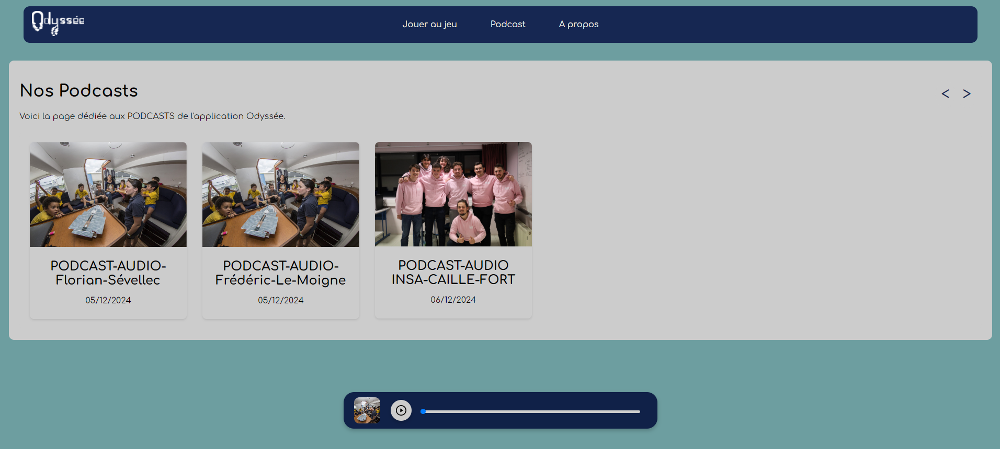

# INSA CAILLE FORT
<strong>L'équipe qui n'a pas froid aux yeux</strong>

The website is available [here](https://insa-caille-fort.fr/)

## Night of IT
This "github organisation" is a group of french students participating in the "[Nuit de l'info](https://nuitdelinfo.com/)" for the edition 2024. This event takes place the first Thursday of December from sunset to sunrise every year since 2007. The point is to answer a client (an association) and create a web application to answer their problem.In addition to the main subject, each team can choose up to 5 challenges. The challenges are proposed by independent companies and lead to independent prizes.

## Who are we ?
We are 7 students of the INSA Hauts-de-France and engineering school in Valenciennes, France, where we study Software Engineering in apprenticeship, and one student in ... .
The team is composed of :  
[Léo WADIN](https://github.com/ArKc0s) 
[Elena BEYLAT](https://github.com/PetitCheveu) 
[Aurélien HOUDART](https://github.com/Zaykiri) 
[Aurélien DUFOUR](https://github.com/Aurelien861) 
[Nicolas WROBEL](https://github.com/Nicolas-wrobel) 
[Mathieu SYMPHORIEN](https://github.com/MathieuSymphorien) 
[Mathéo HERBIN-MAIRESSE](https://github.com/MatheoH-M) 
[Paloma HERBIN-MAIRESSE]() 

## This year's subject
This year we are answering to the association [Race for water](https://www.raceforwater.org/en/).  

The subject (accessible in french [here](https://www.nuitdelinfo.com/materiel_communication/2024/La%20Nuit%20de%20l%E2%80%99Info%202024.pdf)) is about créating a fun and interactive web app that raises awareness of people about the similarities between the human body and ocean work. It was also asked that we can listen to podcasts from that app and that we make a podcast. 

### Our idea 
Our idea is to recreate one of the odysee done by Race for water on a map and then use some of the interest points with buttons. Once one click on the button, a quick quizz starts. The quizz is about the similarities between the human body and the ocean. For that, we first present the human aspect we want to talk about and once the 3 questions about it are answered, the user discovers the ocean aspect through 3 other questions. Then we ask threee more question following the three pillars of race for water : Learn, Share, Act.
In an other page, we implemented a podcast player where the user can listen to the podcasts. And we wrote and register a podcast ourselves. That one can listen to it on the app.

### The technologies
We use Angular.js for the front end and Spring boot for the back end. The database is a PostgreSQL database.
To deploy the app, we use docker and docker-compose.
To make the podcast, we used Audacity and to record the podcast we used a microphone.

### Some pictures of the results
The main map: 

The quizz:

The podcast page:

The about page:

## The challenges we chose and their implementations
### [S'adapter aux nouvelles technologies](https://www.nuitdelinfo.com/inscription/defis/440)
This challenge is about using new technologies, here we were asked to use angular to do the front end.  
As it is just a choice of programming language, you can go and see the repository [caille-fort](https://github.com/INSA-CAILLE-FORT/caille-fort) where all the front is kept.
### [Game Tcha : le CAPTCHA ludique](https://www.nuitdelinfo.com/inscription/defis/443)
This challenge is about creating a CAPTCHA that is fun and original to do.  
We implemented a CAPTCHA that need you to resolve a tiny quizz for each letter of the word captcha. 

To know what to do for each letter, you can pass your mouse over the letter and a tooltip will appear with a clue.

Then once it is done, you can click on the button to check if you are right.

### [On veut du gros pixel ! ](https://www.nuitdelinfo.com/inscription/defis/453)
This challenge is about transforming one of the page of the website into a pixel art.  
For that, we used the Captcha page and transformed it into a pixel art as you can see on the previous pictures.
### [MOVAI CODE 2024](https://www.nuitdelinfo.com/inscription/defis/447)
This challenge is about making bad code. We have to implement it on 1 aspect of the website, but it must still be functionning and giving correct responses. We decided to make this on a part of the about page to know more about the person visiting the web site. So at the end of the about page, you can see a form stuck in the footer, where you are askep about your birthdate, and then we site gives you your age. 

### [Mettez de l'intelligence dans votre moteur](https://www.nuitdelinfo.com/inscription/defis/60)
This challenge is about implementing some AI in the website. We did not got the time to finish the implementation of this challenge, but our idea was to implement a connection with ChatGPT to answer the questions of the quizz. The user is given a question, then they answer it with a text and the AI correct them and complet the answer.
If you are interested about this part, we have the back implementation in [here](https://github.com/INSA-CAILLE-FORT/caille-fort-api).